# Gharana — گھرانہ
### Family Budget & Money Tracker · Flutter App

Gharana ("household" in Urdu) is a full-featured family budget tracker built with Flutter on the frontend and Supabase on the backend. It lets a household manage shared income and expenses across multiple members with role-based permissions (Admin / Manager / Spender), live budget alerts, and animated data visualizations.

Built as a solo project to explore full-stack mobile development — Flutter UI, Supabase for auth and data, custom-painted charts, and role-based access logic.

---

## ✨ Highlights

- **Supabase backend** — real authentication, database, and data sync, not mocked
- **Role-based access control** — Admin, Manager, and Spender roles unlock different permissions across the app
- **Live, synced state** — adding a transaction instantly updates the dashboard, charts, and budgets across the app
- **Custom-painted charts** — animated donut chart and bar charts built from scratch, no charting library
- **Thoughtful UX details** — swipe-to-delete with undo, animated budget alerts, filter chips, pull-to-refresh
- **Cross-platform frontend** — the Flutter UI runs on Android, iOS, and web from a single codebase

---

## 📱 Screenshots

<table>
<tr>
<td align="center"><b>Login</b> 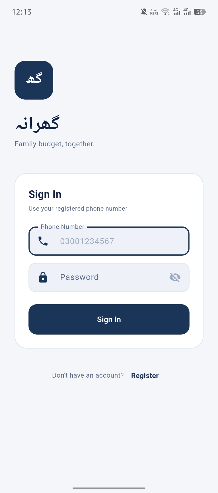</td>
<td align="center"><b>Dashboard / Home</b> 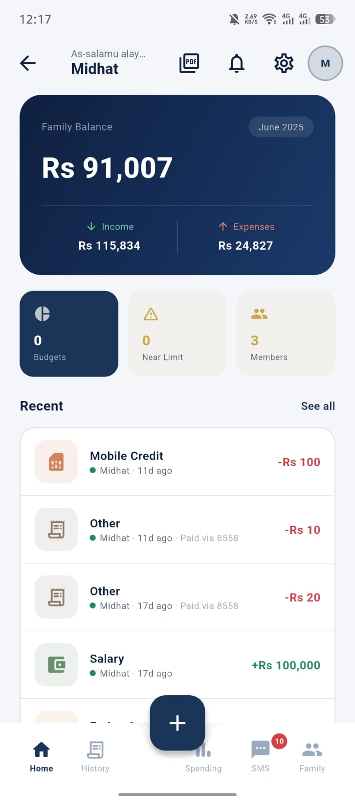</td>
<td align="center"><b>Add Transaction</b> 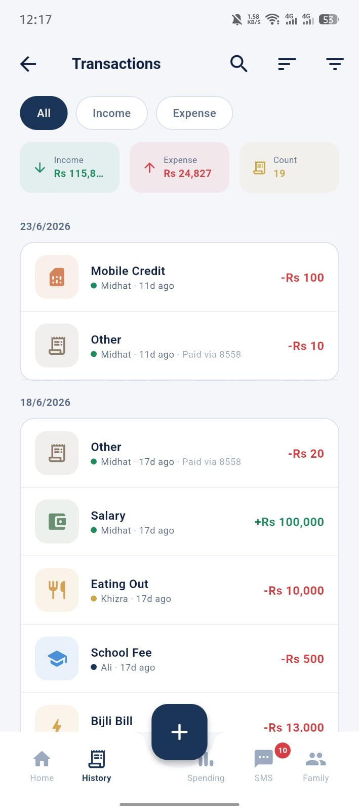</td>
</tr>
<tr>
<td align="center"><b>SMS Parsing</b> 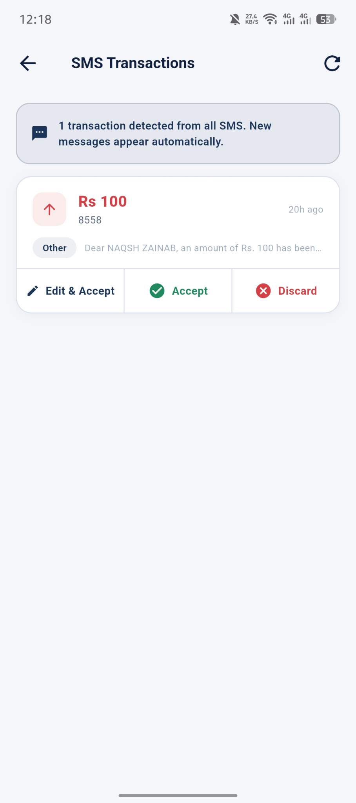</td>
<td align="center"><b>Family Members</b> 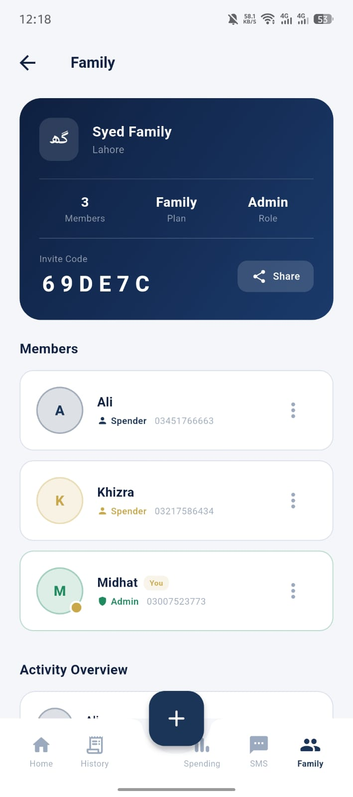</td>
<td align="center"><b>Spending Analysis</b> 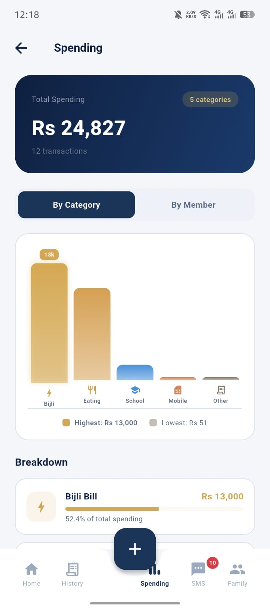</td>
</tr>
</table>

<b>More screens</b> (click to expand)

<table>
<tr>
<td align="center">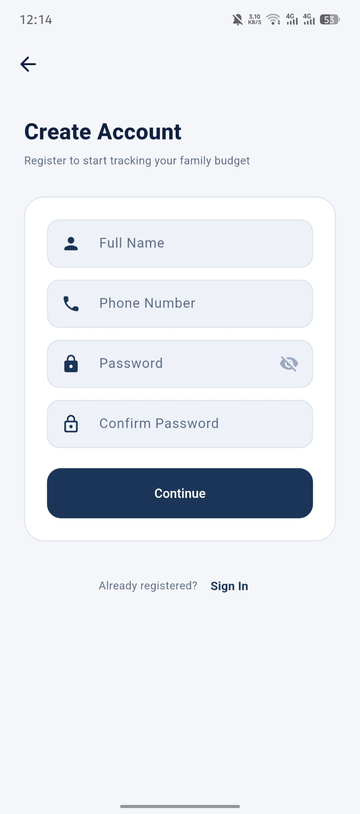</td>
<td align="center">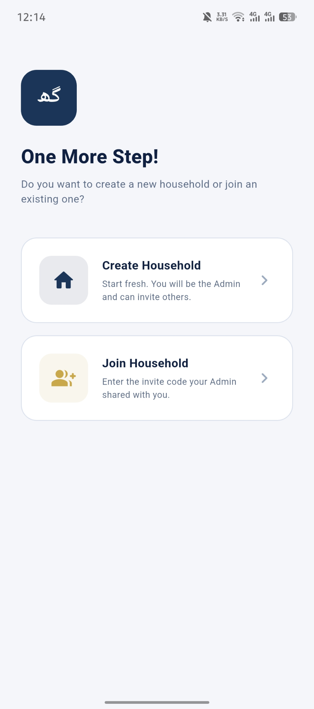</td>
<td align="center">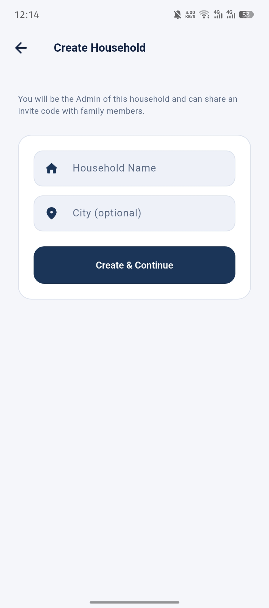</td>
<td align="center">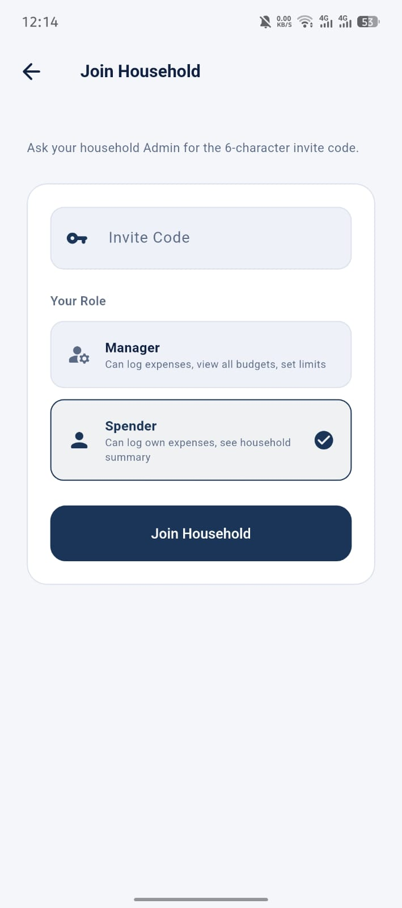</td>
</tr>
<tr>
<td align="center">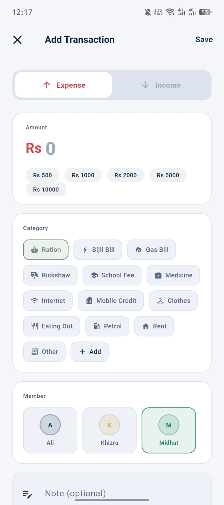</td>
</tr>
</table>

---

## 🧩 Features

### Login
- Phone + password validation against a real in-app member list
- Animated entrance
- Demo account hints for quick testing

### Home / Dashboard
- Live family balance (income − expenses)
- Auto-generated budget near-limit alerts
- Notification bell showing all alerts in a bottom sheet
- Recent transactions with swipe-to-delete
- Pull to refresh

### Transactions
- Search by category, note, or member name
- Sort by date or amount
- Filter by category and member, with active filter chips
- Live summary row (income / expense / count) that updates with filters
- Grouped by Today / Yesterday / N days ago

### Spending Analysis
- Animated donut chart (custom-painted)
- Tap a member's legend pill to highlight their arc and dim the rest
- Animated bar chart that rises from zero on load
- Per-member expandable breakdown cards with horizontal bar charts

### Budgets
- Overall progress ring and bar
- Near-limit warning banner, auto-generated
- Per-category cards with color-coded progress bars
- Edit / delete budgets via a three-dot menu (Admin / Manager only)

### Family
- Household info card
- Member cards with role badges and a "You" indicator
- Add / edit / remove members (Admin only)
- Per-member activity overview

### Add Transaction
- Expense / Income toggle
- Category grid filtered by transaction type
- Quick amount buttons (Rs 500 / 1000 / 2000 / 5000 / 10000)
- Member selector, optional note, date picker
- Saves to Supabase — instantly reflected across every screen and every family member's view

---

## 🎨 Design

Warm, Pinterest-inspired palette:

| Role | Color |
|------|-------|
| Primary | Terracotta `#B85C38` |
| Accent | Sage Green `#6B8F71` |
| Background | Warm off-white `#FAF7F4` |
| Cards | Dark walnut gradient (hero sections) |
| Text | Warm dark brown `#2C1810` |

---

## 🛠️ Tech Stack

- **Frontend:** Flutter (Dart) — runs across Android, iOS, and web
- **Backend:** Supabase (authentication + database)
- **Charts:** Custom `CustomPainter` implementations
- **Architecture:** Screen-based navigation with Supabase-backed shared state

---

## 📌 Roadmap

- [ ] Real SMS parsing integration for auto-logging expenses
- [ ] Export reports (PDF / CSV)
- [ ] Push notifications for budget alerts
- [ ] Offline support with local caching

---

## 👩‍💻 Author

**Midhat**
BSAI Student, Information Technology University (ITU), Lahore

Feel free to reach out or open an issue if you have questions about the implementation.
